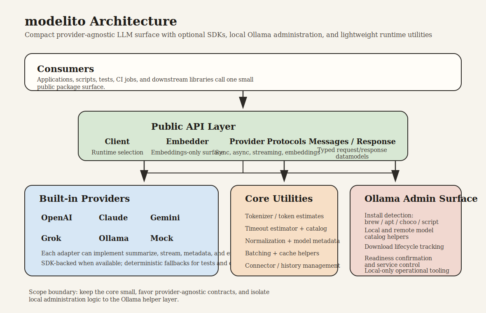
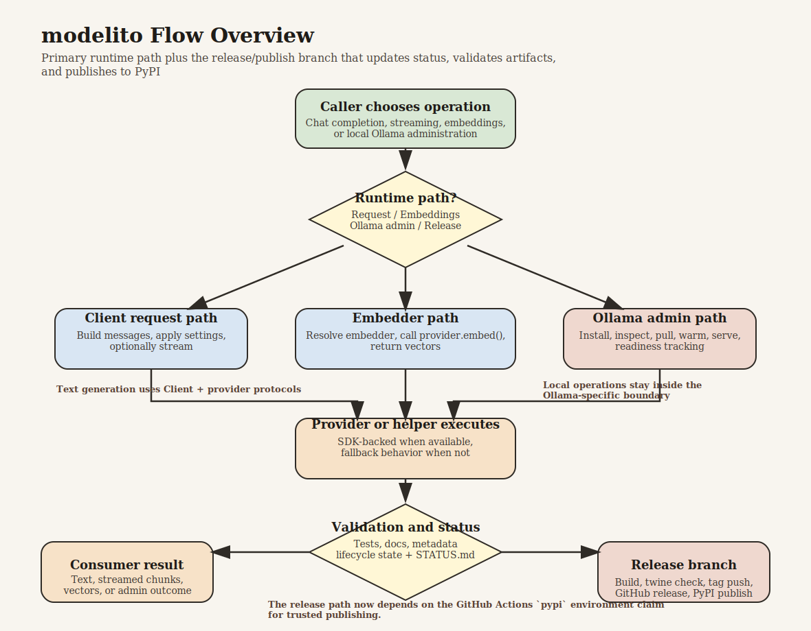

# modelito status report

Last updated: 2026-05-06 19:34

## Current state

modelito remains a compact, provider-agnostic Python library with optional
SDK integrations and strong local/offline fallback behavior.

Current package metadata version is `1.3.0` (`pyproject.toml`).

The package now includes a broader Ollama administration surface alongside the
existing provider/runtime helpers.

The embeddings surface is now also exposed as a first-class runtime-selectable
API via `Embedder`, `EmbeddingProvider`, and embedder registry helpers.

Transport/retry plumbing and stable response/error envelopes are now implemented
for wrapper-style Ollama operations through shared provider-agnostic helpers.

Repository health after implementing all previously listed remediation steps:

- Runtime tests pass locally.
- Lint checks pass locally.
- Packaging build succeeds locally.
- Type checking now passes cleanly.
- Local pytest runs no longer emit the pytest-asyncio loop-scope deprecation warning.
- Previously identified docs/release-history inconsistencies were remediated.
- Markdown diagnostics are clean for `README.md`, `CHANGELOG.md`, `docs/API.md`, `docs/INSTALL.md`, `docs/USAGE.md`, and `RELEASE.md`.

## Current focus

- Stabilize the release pipeline after publishing `v1.2.2`.
- Keep release artifacts (`CHANGELOG.md`, `RELEASE.md`, `STATUS.md`) aligned.

## Visual overview

Architecture diagram:

Flow chart:

## Audit scope

Comprehensive code and docs audit completed across:

- Package/runtime code in `modelito/`
- Tests and CI workflows
- User and API documentation (`README.md`, `docs/`)
- Release/versioning artifacts (`pyproject.toml`, `CHANGELOG.md`, release notes)
- Agent governance files (`AGENTS.md`, `STATUS.md`)

## Remediation summary

All six previously listed next steps have been implemented.

Completed items:

1. Fixed package version fallback mismatch.
   - `modelito/__init__.py` fallback now uses `1.2.0` instead of `1.0.0`.

2. Fixed incorrect connector usage docs.
   - Updated `docs/USAGE.md` to show `OllamaConnector(provider=provider)`.

3. Resolved API export/documentation mismatch.
   - Exported `estimate_remote_timeout_details` from `modelito/__init__.py`.
   - Updated `docs/API.md` package export section accordingly.

4. Fixed mypy failure in normalization helper.
   - Refactored `_normalize_model_item` local variable usage in
     `modelito/normalization.py` to avoid incompatible assignment typing.

5. Normalized release history structure.
   - Reordered and clarified `CHANGELOG.md` with a current `1.2.0` section and
     explicit historical backfill note.

6. Implemented archival strategy for old release notes.
   - Marked `RELEASE_NOTES_v1.0.3.md` and `RELEASE_ANNOUNCEMENT_v1.0.3.md` as
     archived historical records.
   - Added archival policy note in `RELEASE.md`.

Additional quality cleanup completed:

- Removed duplicate `OllamaProvider` bullet in `docs/API.md`.

## Ollama admin gap analysis

Reviewed the current Ollama package surface against the claim that core
administration utilities were still missing.

Confirmed already present in the public API:

- Install helper: `install_ollama` plus `install_command_for_current_platform`.
- Stop helpers: `stop_ollama` and `stop_service`.
- Remote listing: `list_remote_models` and `api_list_remote`.
- Pull helpers: `download_model`, `pull_model`, `api_pull`, `api_pull_stream`.
- Delete helpers: `delete_model` and `api_delete_model`.
- Serve/warm helpers: `serve_model`, `preload_model`, and startup warming in
   `start_service`.

Confirmed still missing or underpowered:

- Package-manager-aware install detection beyond the existing Homebrew/script
   logic, especially `apt` and `choco` flows.
- A richer remote model catalog abstraction beyond a best-effort flat list.
- Structured download progress and lifecycle state tracking keyed by model.
- A stronger model warm/readiness helper that confirms a specific model is
   loaded rather than only confirming server liveness.

## Ollama admin implementation update

All four confirmed gaps from the analysis above have now been implemented.

Completed in this work session:

1. Added package-manager-aware install backend detection.
    - Implemented `detect_install_method()`.
    - Extended install flows to support `brew`, `apt`, and `choco` with
       fallback to the official Ollama scripts.

2. Added a richer remote model catalog abstraction.
    - Introduced `RemoteModelCatalogEntry`.
    - Added `list_remote_model_catalog(query=None)` for stable remote model
       metadata and query filtering.

3. Added structured per-model lifecycle tracking.
    - Introduced `ModelLifecycleState`.
    - Added `download_model_progress()`,
       `get_model_lifecycle_state()`,
       `list_model_lifecycle_states()`, and
       `clear_model_lifecycle_state()`.
    - Updated `download_model()` to consume the progress-aware lifecycle path.

4. Added explicit model readiness confirmation.
    - Implemented `ensure_model_ready()` and `async_ensure_model_ready()`.
    - Readiness now means server available, model present, warm-up attempted,
       and a model-scoped readiness probe succeeded.

5. Exposed and documented the new admin helpers.
    - Exported the new helpers from `modelito.__init__`.
    - Added thin wrappers in `modelito.ollama_api`.
    - Updated `README.md`, `docs/API.md`, `docs/USAGE.md`, and
       `docs/INSTALL.md`.

6. Added focused unit coverage for the new admin surface.
    - Added `tests/test_ollama_admin_helpers.py`.

## Validation

Validation executed during this audit and implementation pass:

- `pytest -q tests/test_install_helpers.py tests/test_ollama_model_mgmt.py tests/test_ollama_admin_helpers.py tests/test_ensure_model_available.py tests/test_ollama_cli_helpers.py tests/test_ollama_running_verbose.py` -> 17 passed.
- `pytest -q` -> 96 passed, 3 skipped, with no `pytest-asyncio` deprecation warning after setting `asyncio_default_fixture_loop_scope = function` in `pytest.ini`.
- `ruff check .` -> all checks passed on the final post-change tree.
- `mypy modelito --ignore-missing-imports` -> success after a small typing-only
   fix in the new apt install-command branch of `ollama_service.py`.
- `/Users/tom/devel/ml-llm/llm/modelito/.venv/bin/python -m build` -> built `modelito-1.2.2.tar.gz` and `modelito-1.2.2-py3-none-any.whl` successfully.
- `/Users/tom/devel/ml-llm/llm/modelito/.venv/bin/python -m twine check dist/*` -> passed.
- `gh release create v1.2.2` -> GitHub release created successfully.
- `gh run view 25457971984 --log-failed` -> publish workflow failed only at the
   trusted-publishing exchange step with `invalid-publisher`.
- `python -m twine upload --skip-existing dist/*` -> manual PyPI upload
   succeeded.
- `https://pypi.org/pypi/modelito/1.2.2/json` -> version-specific PyPI metadata
   resolves to `1.2.2`.
- Fresh install verification from PyPI succeeded after index propagation:
   `pip install --no-cache-dir modelito==1.2.2` followed by `import modelito`
   reported `1.2.2`.
- `pytest -q tests/test_plumbing.py tests/test_ollama_plumbing.py tests/test_ollama_admin_helpers.py tests/test_client.py tests/test_embeddings.py` -> 23 passed.
- Historical validation from the earlier audit in the same session remains:
   `python -m build` completed successfully.

## Release outcome

Release `v1.2.2` has been completed.

- Release commit created and pushed to `main`.
- Tag `v1.2.2` created and pushed.
- GitHub release created successfully.
- PyPI publish workflow triggered automatically from the tag push.
- Automatic trusted publishing failed because the PyPI trusted publisher
   configuration does not match this repository/workflow claims.
- The release was published to PyPI successfully via manual `twine upload`
   using maintainer credentials available on the local machine.

## Trusted publishing follow-up

Root cause of the failed `v1.2.2` PyPI trusted-publishing run was confirmed
from the GitHub Actions logs: the OIDC token reached PyPI without an
`environment` claim, and PyPI reported `environment: MISSING` alongside
`invalid-publisher`.

Remediation applied in this session:

- Updated `.github/workflows/publish.yml` so the publish job runs inside the
   dedicated GitHub Actions environment `pypi`.

Expected effect:

- Future tag-triggered PyPI publishes should now present the `environment: pypi`
   claim expected by the configured trusted publisher, removing the previous
   need for a manual `twine upload` fallback if the PyPI-side publisher record is
   otherwise correct.

## Embeddings API refinement

The package previously supported embeddings only as an optional provider method
and a small deterministic stub helper. That surface is now promoted into a
small explicit public API without widening the project scope into a broader RAG
or vector-database framework.

Completed in this session:

- Added provider-registry helpers `get_embedder()` and `list_embedders()`.
- Added `Embedder`, a narrow embeddings-only runtime wrapper parallel to the
   existing `Client` runtime-selection surface.
- Exported `EmbeddingProvider`, `Embedder`, `StubEmbeddingProvider`, and
   `embed_texts` from the top-level package.
- Added client-level discoverability through `Client.available_embedders()`.
- Added focused tests for the embedder registry and runtime wrapper.
- Updated `README.md`, `docs/API.md`, and `docs/USAGE.md` to document the new
   public surface.

## Code/docs consistency assessment

Confirmed consistent:

- Core API narratives in `README.md` generally match implementation behavior.
- CI workflow and testing docs are largely aligned on integration gating.
- Packaging metadata and build system operate correctly.

Outstanding minor observations:

- CI intentionally excludes integration tests by path (`--ignore`) instead of
  marker selection; behavior is correct and documented.
- The new lifecycle tracker is in-memory only; it is intended for local tools
   and short-lived processes, not cross-process persistence.
- A future flavour or configurable option for persistent lifecycle storage may
   still be worth adding if downstream tooling needs cross-process or
   long-running operation tracking.

## Architectural decisions

1. API key storage should not move into a built-in encrypted database in the
   core package.
   - The project's current value is that it is dependency-light,
     provider-agnostic, and easy to embed.
   - Secure secret storage is platform-specific and is better delegated to
     environment variables, OS keychains, container/orchestrator secrets, or
     dedicated secret managers such as Keychain, Secret Service, Windows
     Credential Manager, Vault, or cloud secret stores.
   - If demand appears, the right extension point is an optional pluggable
     key-provider or keyring integration, not a mandatory encrypted database in
     `modelito` itself.

2. Cloud-provider integrations should remain lightweight shims by default.
   - `modelito` should keep focusing on a stable common surface: request/response
     normalization, streaming behavior, timeout handling, embeddings, and small
     provider-specific compatibility helpers.
   - Deeper provider features should only be added when they either map cleanly
     across providers or clearly belong as optional, provider-specific helpers.
   - Secret management, deployment orchestration, large admin surfaces, and
     provider-console workflows should stay outside the core library unless the
     project intentionally broadens scope.

3. Keep reviewing provider additions against the "portable common surface first,
   optional provider-specific helper second" rule.

## Next prioritized steps

1. Exercise the updated publish workflow on the next release tag to confirm the
   PyPI trusted publisher now matches successfully.

## Implementation spec (completed)

This session implemented and validated two buckets of runtime infrastructure
while keeping the package dependency-light and provider-agnostic.

Implemented deliverables:

1. Generic Ollama lifecycle mechanics
    - Added explicit health-check and readiness-probe helpers for local Ollama
       (`ollama_health_check`, `ollama_readiness_probe`).
    - Added explicit ensure-loaded lifecycle primitive (`ensure_model_loaded`)
       while preserving `ensure_model_ready` behavior.
    - Kept pull/delete/list/running operations and added envelope wrappers in
       `ollama_api` for these operations.
    - Added retry/backoff mechanics for HTTP probe operations in `json_get` and
       `json_post` through shared transport policy helpers.
    - Normalized network/transport failures into stable error objects.

2. Provider-agnostic plumbing
      - Introduced transport policy primitives (timeouts, attempts, backoff) via
         `TransportPolicy` and `retry_with_backoff`.
      - Introduced consistent response/error envelopes (`ResponseEnvelope`,
         `ErrorEnvelope`, `envelope_ok`, `envelope_error`).
      - Added thin command wrappers in `ollama_api`, including `api_health`,
         `api_readiness`, `api_ensure_model_loaded`, and envelope variants for
         list/pull/delete/running-model operations.

Implemented API shapes:

- `TransportPolicy`: timeout, max attempts, base/max delay, backoff factor.
- `retry_with_backoff(...)`: reusable retry execution helper.
- `normalize_network_error(...)`: map socket/timeout/HTTP failures to stable
   error codes and retryability flags.
- `ResponseEnvelope` / `ErrorEnvelope`: stable envelope dataclasses.
- Ollama wrappers:
   `api_health()`, `api_readiness()`, `api_ensure_model_loaded()`, and
   envelope variants for list/pull/delete/running operations.

Acceptance criteria outcome:

- Met. New mechanics are additive and backward-compatible with existing public
   functions.
- Met. Existing targeted tests used in this scope keep passing.
- Met. New tests cover retry behavior, error normalization, envelopes, and new
   command wrappers.

## Future steps pending evaluation and demand / usefulness analysis

1. Optionally add a persistent lifecycle-storage flavour or runtime option if
   downstream tooling needs cross-process or long-running operation tracking.
2. If secret-storage demand grows, design an optional pluggable key-provider
   interface rather than embedding encrypted storage in the core package.
3. If embedding use grows, consider adding async embedding support while keeping
   vector stores, chunking pipelines, and RAG orchestration out of core scope.
